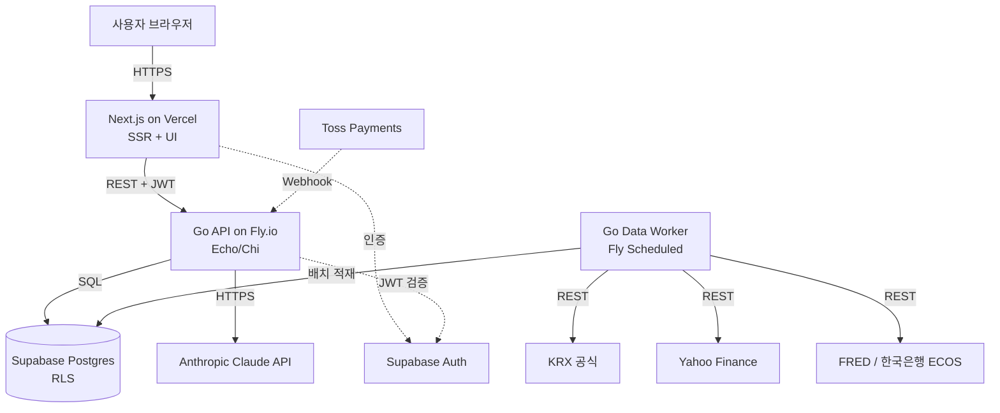

# Quotient — 아키텍처

## 시스템 개요

## 핵심 설계 결정

### 1. Go 백엔드 + Next.js 프론트엔드 (분리형)

**Why**:
- 실제 금융 회사에서 Go 채택 확대 (Stripe·Capital One·카카오뱅크 일부). 포트폴리오 가치 + 사용자 학습 가치.
- 데이터 수집은 동시성·메모리 효율이 중요. Go가 적합.
- Next.js 풀스택 단일 코드보다 정적 자산 캐시·서버 부하 분리에 유리.

**How**:
- Go 단일 모노레포에서 두 바이너리 산출: API 서버 + 데이터 워커.
- Next.js는 UI·SSR 한정. 자체 API 라우트 최소화 (BFF 패턴 회피).
- 인증은 Supabase Auth JWT를 양쪽이 검증.

**Trade-off**: 두 언어 운영 부담 + Go의 한국 금융 데이터 라이브러리 부족. → KRX 공식 다운로드 + KIS Open API + Yahoo·Alpha Vantage 직접 HTTP 호출로 해결.

### 2. Supabase Postgres + RLS

**Why**:
- 단일 인프라로 DB·Auth·Storage 해결. 1인 운영에 적합.
- RLS로 권한 누락 실수 차단 (애플리케이션 코드 신뢰 의존도 감소).
- 무료 티어로 초기 사용자 수만 명 커버.

**How**:
- 사용자 데이터 테이블: `user_id = auth.uid()` RLS 강제.
- 공개 데이터 (instruments·prices·quotes·indicators·instrument_aliases): 인증 사용자 읽기 허용, 쓰기는 service_role 전용.

### 3. 마이데이터 미사용·자금 미보관

**Why**:
- 마이데이터·전자금융업은 법인 + 자본금 요건. 개인 운영 불가능.
- 자금 보관·이체는 본 서비스 범위 밖. 데이터·분석만 제공 → 규제 회피.

**How**:
- Phase 1: 사용자 수동 입력. Phase 2: CSV 업로드 + LLM 파싱. Phase 3: KIS Open API 본인 계좌 연동.
- 결제는 Toss Payments에 완전 위임 (PG가 PCI·자금 처리).

### 4. 블룸버그 터미널 풍 디자인

**Why**:
- 대중적 핀테크(토스·뱅크샐러드)와 시각·정체성 차별화.
- 개발자·파워유저 타겟 부합 (정보 밀도·키보드 우선·단축키 문화).

**How**:
- 다크 배경, 고채도 색상 (초록·빨강·노랑·시안), monospace + sans 혼용.
- 상단 실시간 티커, 하단 상태바, 좌측 사이드바.
- 키보드 단축키 + ⌘K 명령 팔레트.

### 5. 통화·시간 정책

**Why**: 환율 변동·시간대 혼선 방지.

**How**:
- 저장: 금액은 `instrument.currency` 원본. 시간은 UTC.
- 표시: 사용자 `base_currency` (기본 KRW)로 환산, 시간 KST.
- 변환은 서비스 레이어에서. 저장된 값은 무손실.

### 6. AI 카피 노출 금지 (브랜딩)

**Why**: 블룸버그 풍 진지함과 AI 마케팅 카피 충돌. 흔한 AI 서비스로 보이지 않게.

**How**: 메인·서브 카피에서 "AI" 단어 금지. 대체어: "분석가", "인텔리전스", "터미널", "엔진". AI는 내부 메커니즘으로만.

### 7. 데이터 수집 — 단일 프로세스 + 15분 지연 시세 (MVP)

**Why**:
- 1인 운영 + Phase 1 사용자 규모에서 워커 분리는 과한 복잡도. 단일 바이너리(API + cron 워커 goroutine)가 단순.
- 한국·미국 실시간(Tick) 시세는 개인이 무료로 정식 확보 불가. 회색지대 스크래핑은 법·운영 리스크. 15분 지연 공개 데이터로 충분 (타겟이 데이트레이더가 아니라 분석가).

**How**:
- Go 단일 바이너리에 Echo/Chi + `robfig/cron` 동거.
- 외부 소스: KRX 공식 다운로드, Yahoo Finance (`piquette/finance-go`), FRED, 한국은행 ECOS, `exchangerate.host`.
- KIS Open API는 Phase 3에서 사용자 본인 키 등록 시 활성화.
- 실패 시 지수 백오프 5회 → 누적 3회 실패 시 잡 정지 + 알림.

**Trade-off**: 15분 지연은 단타·스캘핑 사용자에게 부적합. → 명시적 비타겟. UI에 "지연 15분" 표기로 기대치 정렬.

### 8. 수익화 경로 — MVP 무료 + 광고 슬롯 + 결제 비활성

**Why**:
- 한국 법규상 결제 수익 발생 시 사업자 등록 의무. 사용자는 등록 부담을 출시 후로 미루기 원함.
- MVP는 사용자 검증·피드백 단계. 결제 없이 출시하면 가입 장벽 최저.
- 광고(AdSense 등)는 사업자 등록 없이도 종합소득세 기타소득 신고로 처리 가능.

**How**:
- Pro·결제 UI는 라우트 차단 (`PAYMENTS_ENABLED=false`)
- 결제 코드 (Toss 위젯·webhook·정기 결제 cron)는 MVP 미작성, Phase 2 도입
- `subscriptions`·`payment_events` 테이블 스키마만 유지
- `<AdSlot>` 추상화. AdSense 가입 전까지 자체 메시지 표시 (`ENABLE_ADS=false`)
- AdSense 가입 조건: 가입자 100명 + 일평균 PV 500

**Trade-off**: 매출 0원으로 시작. 사용자 검증 후 사업자 등록·결제 활성화 시점은 별도 결정.

### 9. 페르소나 분리 운영

**Why**: 1인 운영이지만 의사결정의 관점은 다층적이어야 함. 비용·기술·시장 관점이 충돌할 때 명시적으로 페르소나를 분리해 검토.

**How**: CEO·CTO·CFO 페르소나로 결정. 페르소나 명시 후 결정 사유 기록. 실행 페르소나는 `docs/AGENTS.md` 참고.

---
업데이트 규칙: 새 컴포넌트·중대 설계 변경에만 추가. Why를 반드시 명시. 변경이력은 STATUS의 "최근 변경 이력"에 동시 기록.
