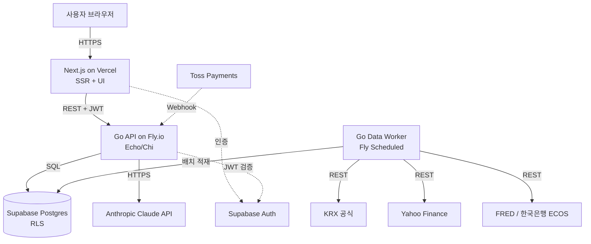

# Quotient — 아키텍처

## 시스템 개요

## 핵심 설계 결정

### 1. Go 백엔드 + Next.js 프론트엔드 (분리형)

**Why**:
- 실제 금융 회사에서 Go 채택 확대 (Stripe·Capital One·카카오뱅크 일부). 포트폴리오 가치 + 사용자 학습 가치.
- 데이터 수집은 동시성·메모리 효율이 중요. Go가 적합.
- Next.js 풀스택 단일 코드보다 정적 자산 캐시·서버 부하 분리에 유리.

**How**:
- Go 단일 모노레포에서 두 바이너리 산출: API 서버 + 데이터 워커.
- Next.js는 UI·SSR 한정. 자체 API 라우트 최소화 (BFF 패턴 회피).
- 인증은 Supabase Auth JWT를 양쪽이 검증.

**Trade-off**: 두 언어 운영 부담 + Go의 한국 금융 데이터 라이브러리 부족. → KRX 공식 다운로드 + KIS Open API + Yahoo·Alpha Vantage 직접 HTTP 호출로 해결.

### 2. Supabase Postgres + RLS

**Why**:
- 단일 인프라로 DB·Auth·Storage 해결. 1인 운영에 적합.
- RLS로 권한 누락 실수 차단 (애플리케이션 코드 신뢰 의존도 감소).
- 무료 티어로 초기 사용자 수만 명 커버.

**How**:
- 사용자 데이터 테이블: `user_id = auth.uid()` RLS 강제.
- 공개 데이터 (instruments·prices·quotes·indicators·instrument_aliases): 인증 사용자 읽기 허용, 쓰기는 service_role 전용.

### 2-A. 사용자 JWT 풀 패턴 (`db.AsUser`)

**결정**: 사용자 데이터 핸들러는 단일 슈퍼유저 pgxpool 위에서 트랜잭션을 열어
`set_config('role', 'authenticated', true)` + `request.jwt.claims` + `request.jwt.claim.sub`를
LOCAL 적용한다. cron 잡·도구 레지스트리·공개 read(market/instruments/history)·브리핑 작성 워커는
슈퍼유저 풀 그대로 사용.

**Why**:
- 풀을 분리하지 않아 connection 소비를 1배수로 유지(Supabase Free 60 connection 한도 압박 회피).
- `set_config(_, _, true)`로 LOCAL 적용 — 트랜잭션 종료 시 자동 해제, leak 불가.
- 애플리케이션 `WHERE user_id = $1` 필터는 fail-safe 이중 방어로 유지.
- cron·브리핑 작성은 다중 사용자 fan-out이라 단일 사용자 JWT를 가질 수 없음 → 슈퍼유저 풀이 자연스러움.

**How**:
- `internal/db/executor.go`: `Executor` 인터페이스(=`*pgxpool.Pool` ∪ `pgx.Tx`).
- `internal/db/userjwt.go`: `AsUser(ctx, pool, userID, fn)` 헬퍼. `claims` JSON + `claim.sub` 폴백 둘 다 set, rollback은 별도 background ctx로.
- repo는 stateless, 메서드가 `db.Executor` 받음.
- handler는 `txRunner`(read용) + `runAs`(inline persist용) 클로저로 wrap. `pool == nil` passthrough로 fake repo 테스트 호환.
- chat handler의 SSE 영속화는 `context.Background()` 기반 새 ctx + `runAs(ctx, uid, fn)` — 사용자 disconnect 후에도 영속화 보장.
- 보호 대상 테이블: `profiles`, `holdings`, `watchlist`, `chat_sessions`, `chat_messages`, `chat_usage_monthly`, `ai_briefings`.
- RLS 격리 회귀 가드: `apps/api/internal/db/rls_integration_test.go` (`//go:build integration`).

**비용**: 요청당 BEGIN + set_config*3 + COMMIT = 5 round-trip 추가. 로컬 PG에서는 무시 가능, region 거리에 비례. Vercel→Fly→Supabase 모두 같은 region에 배치 권장.

**범위 외**: AI 도구(portfolio·search·quote)의 사용자 데이터 read는 여전히 슈퍼유저 풀 + handler 단 `user_id` 필터 사용. spec §10-1 완전 정합을 위해서는 도구 시그니처에 `exec db.Executor` 인자 추가 + chat handler tool routing 안에서 `db.AsUser` wrap이 필요. 별도 PR로 분리.

### 3. 마이데이터 미사용·자금 미보관

**Why**:
- 마이데이터·전자금융업은 법인 + 자본금 요건. 개인 운영 불가능.
- 자금 보관·이체는 본 서비스 범위 밖. 데이터·분석만 제공 → 규제 회피.

**How**:
- Phase 1: 사용자 수동 입력. Phase 2: CSV 업로드 + LLM 파싱. Phase 3: KIS Open API 본인 계좌 연동.
- 결제는 Toss Payments에 완전 위임 (PG가 PCI·자금 처리).

### 4. 블룸버그 터미널 풍 디자인

**Why**:
- 대중적 핀테크(토스·뱅크샐러드)와 시각·정체성 차별화.
- 개발자·파워유저 타겟 부합 (정보 밀도·키보드 우선·단축키 문화).

**How**:
- 다크 배경, 고채도 색상 (초록·빨강·노랑·시안), monospace + sans 혼용.
- 상단 실시간 티커, 하단 상태바, 좌측 사이드바.
- 키보드 단축키 + ⌘K 명령 팔레트.

### 5. 통화·시간 정책

**Why**: 환율 변동·시간대 혼선 방지.

**How**:
- 저장: 금액은 `instrument.currency` 원본. 시간은 UTC.
- 표시: 사용자 `base_currency` (기본 KRW)로 환산, 시간 KST.
- 변환은 서비스 레이어에서. 저장된 값은 무손실.

### 6. AI 카피 노출 금지 (브랜딩)

**Why**: 블룸버그 풍 진지함과 AI 마케팅 카피 충돌. 흔한 AI 서비스로 보이지 않게.

**How**: 메인·서브 카피에서 "AI" 단어 금지. 대체어: "분석가", "인텔리전스", "터미널", "엔진". AI는 내부 메커니즘으로만.

### 7. 데이터 수집 — 단일 프로세스 + 15분 지연 시세 (MVP)

**Why**:
- 1인 운영 + Phase 1 사용자 규모에서 워커 분리는 과한 복잡도. 단일 바이너리(API + cron 워커 goroutine)가 단순.
- 한국·미국 실시간(Tick) 시세는 개인이 무료로 정식 확보 불가. 회색지대 스크래핑은 법·운영 리스크. 15분 지연 공개 데이터로 충분 (타겟이 데이트레이더가 아니라 분석가).

**How**:
- Go 단일 바이너리에 chi + `robfig/cron/v3 (SkipIfStillRunning)` 동거. 6 잡: instruments·KR prices·US prices·index quotes(60s TTL)·FX·indicators.
- 외부 소스: KIND 공개 HTML (KR 종목 마스터, KRX 직접 호출 차단), Yahoo Finance (`piquette/finance-go`, KR `.KS/.KQ` + US 통합 + 지수 `^KS11/^GSPC` 등), FRED, 한국은행 ECOS, frankfurter.dev (USD→KRW/EUR/JPY, exchangerate.host 유료화로 교체).
- KIS Open API는 Phase 3에서 사용자 본인 키 등록 시 활성화.
- 실패 시 지수 백오프 5회 (`internal/sources/common/backoff.go`). 잡 단위 부분 적재 허용 (개별 종목 실패 skip + 다음 cron 재시도). 누적 3회 실패 시 Resend 알림은 W5 백로그.

**Trade-off**: 15분 지연은 단타·스캘핑 사용자에게 부적합. → 명시적 비타겟. UI에 "지연 15분" 표기로 기대치 정렬.

### 8. 수익화 경로 — MVP 무료 + 광고 슬롯 + 결제 비활성

**Why**:
- 한국 법규상 결제 수익 발생 시 사업자 등록 의무. 사용자는 등록 부담을 출시 후로 미루기 원함.
- MVP는 사용자 검증·피드백 단계. 결제 없이 출시하면 가입 장벽 최저.
- 광고(AdSense 등)는 사업자 등록 없이도 종합소득세 기타소득 신고로 처리 가능.

**How**:
- Pro·결제 UI는 라우트 차단 (`PAYMENTS_ENABLED=false`)
- 결제 코드 (Toss 위젯·webhook·정기 결제 cron)는 MVP 미작성, Phase 2 도입
- `subscriptions`·`payment_events` 테이블 스키마만 유지
- `<AdSlot>` 추상화. AdSense 가입 전까지 자체 메시지 표시 (`ENABLE_ADS=false`)
- AdSense 가입 조건: 가입자 100명 + 일평균 PV 500

**Trade-off**: 매출 0원으로 시작. 사용자 검증 후 사업자 등록·결제 활성화 시점은 별도 결정.

### 9. 페르소나 분리 운영

**Why**: 1인 운영이지만 의사결정의 관점은 다층적이어야 함. 비용·기술·시장 관점이 충돌할 때 명시적으로 페르소나를 분리해 검토.

**How**: CEO·CTO·CFO 페르소나로 결정. 페르소나 명시 후 결정 사유 기록. 실행 페르소나는 `docs/AGENTS.md` 참고.

### 10. 차트 라이브러리 — recharts (W5)

**Why**: React 표준 + SVG + TypeScript 지원. 단일 라이브러리로 라인·도넛·미니 스파크라인 모두 처리. 도입 비용 낮고 커뮤니티 견고. ~80KB gzipped.

**How**:
- 마켓 탭 `LineChartCard` + 포트폴리오·watchlist `Sparkline` 공통 사용.
- `next/dynamic` + `ssr: false`로 사용 페이지에서만 로드 (SSR 단계 회피 — recharts는 window 의존).
- 색상은 hex 직접 (Tailwind class 미인식). `chart-tokens.ts`에 토큰 집중.

**Trade-off**: lightweight-charts 대비 캔들·볼린저 등 금융 차트 전용 기능 부재 → v2 이후 트레이딩뷰 스타일 필요 시 별도 페이지로 분리 검토.

### 11. 백테스트 엔진 — 통합 바스켓 시뮬레이터 (서브시스템 B)

**Why**: 전략과 벤치마크(KOSPI·S&P·한미 60/40)를 같은 코드로 돌려야 초과수익 비교가 공정하다. 적립식(DCA)에서 단순 누적수익률은 투입 시점에 오염되므로 NAV/유닛 펀드 회계로 "수익률"과 "투입"을 분리한다.

**How**:
- "모든 것은 바스켓" — 순수 `simulate(days, legs, plan, rebalance)` 하나로 전략 + 벤치마크 3종을 동일 캐시플로우·리밸런싱으로 4회 실행. 벤치마크는 지수=비중 100% 바스켓(60/40은 KOSPI 60·SPX 40).
- NAV/유닛: 투입 시 현재 NAV로 유닛 발행 → NAV는 투입에 불변. TWR = NAV(tN)−1, 머니가중 CAGR은 XIRR(Newton + 이분법 폴백, 실패 시 null).
- 통화 정합: 각 레그(KOSPI·SPX)는 자기 t0에 정규화 → 지수·주가 스케일 상쇄. SPX 레그만 시점별 USD/KRW 적용(이중 환산 방지).
- 5년·종료일 오늘 클램프: 시작일 = max(요청, 전략·벤치마크 레그별 최초 가용일, USD 레그 fx 최초 가용일). <30일이면 INSUFFICIENT_DATA. 데이터 짧은 전략 레그는 커버리지 경고.
- 무상태: 신규 테이블 0. 사용자 데이터 미접근 → `db.AsUser`/RLS 불필요(인증 게이트만, 공개 가격·지수·환율을 슈퍼유저 풀로 read). `internal/portfolio/` 패키지에서 알파 카드와 공존.

**Trade-off**: 전진 채움(forward-fill)으로 희소 가격을 클램프 축에 조밀화 — 결측 구간은 직전 종가 유지(룩어헤드 없음). 파라미터 최적화·전략 자동 추천은 규제·과적합 우려로 영구 제외(spec §13).

### 12. 미들웨어 온보딩 게이트 — read-through 쿠키 캐시

**Why**: Next.js 프록시 미들웨어가 `/app/*` 매 요청마다 `profiles.onboarding_completed`를 조회(N+1)했다. 온보딩 완료는 단조 상태(false→true 전이만)라 매 요청 DB를 칠 이유가 없다.

**How**:
- 미들웨어가 `onboarding_completed=true`를 한 번 확인하면 `q_onboarded=1` 쿠키 발급(httpOnly, prod에서만 secure, sameSite lax, path `/`, maxAge 1년). 이후 요청은 쿠키가 있으면 `if` 게이트(`request.cookies.get("q_onboarded")?.value !== "1"`)에서 조회를 통째로 스킵.
- `auth.getUser()` 세션 검증은 게이트와 무관하게 매 요청 실행 — 쿠키는 프로필 조회만 단축하지 인증을 대체하지 않는다.
- `profile=null`(조회 실패)이면 쿠키 미발급 → 다음 요청 재조회(안전한 degrade).

**Trade-off**: 단조 플래그라 stale·위조 쿠키도 안전 방향으로만 작용 — 위조 시 자기 온보딩 화면을 스킵하는 것이 최악(쓰기·타 사용자 영향 없음). 서버측 무효화 수단은 없으나 단조성으로 불필요. JWT custom claim 캐싱 대안 대비 Supabase Auth 재발급 흐름 무변경 + USER_ACTION 0.

---
업데이트 규칙: 새 컴포넌트·중대 설계 변경에만 추가. Why를 반드시 명시. 변경이력은 STATUS의 "최근 변경 이력"에 동시 기록.
